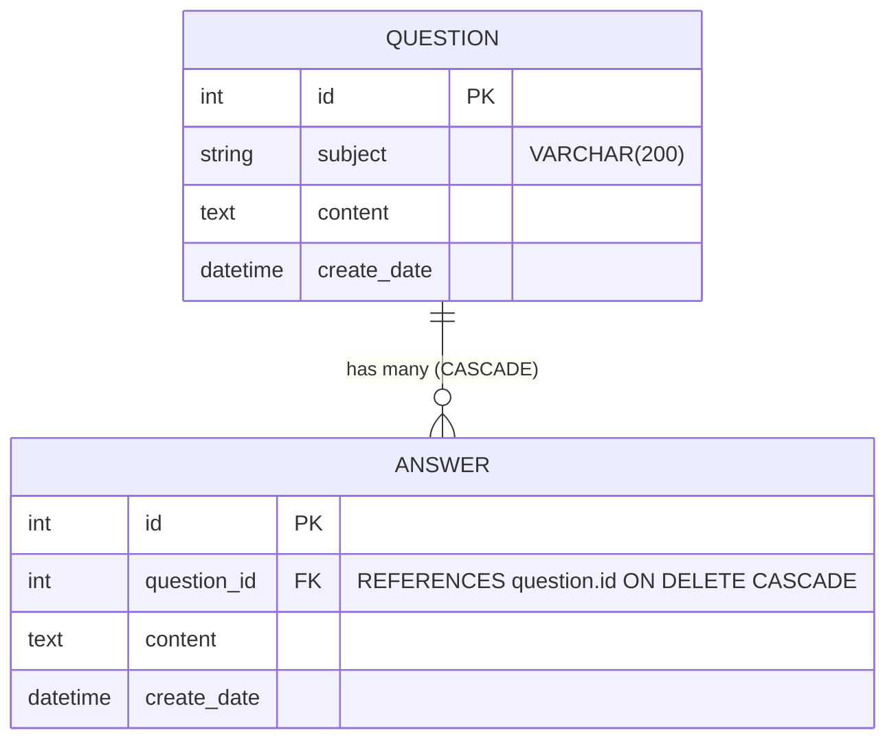

# 📌 Pybo Flask 프로젝트 분석 보고서

본 문서는 **Flask 기반 Q&A 게시판 웹 애플리케이션(Pybo)** 프로젝트의 아키텍처, 데이터 모델, 라우팅 구조, 기술 스택 및 현재 개발 상태를 분석하여 정리한 문서입니다.

---

## 1. 프로젝트 개요 (Overview)

- **프로젝트명**: Pybo (Python Board)
- **개발 환경**: Python 3.13 / Flask 3.1.3
- **주요 목적**: 질문과 답변을 등록하고 조회할 수 있는 계층형 Q&A 게시판 웹 서비스
- **디자인 패턴**: 애플리케이션 팩토리(Application Factory) 패턴 및 블루프린트(Blueprint) 모듈화 아키텍처

---

## 2. 기술 스택 (Tech Stack)

| 구분 | 기술 / 라이브러리 | 버전 | 용도 |
| :--- | :--- | :--- | :--- |
| **Backend** | Python | 3.13 | 런타임 언어 |
| | Flask | 3.1.3 | 경량 웹 프레임워크 |
| **ORM / DB** | Flask-SQLAlchemy | 3.1.1 | ORM(객체 관계 매핑) 라이브러리 |
| | SQLAlchemy | 2.0.52 | Python SQL 툴킷 |
| | SQLite (`pybo.db`) | 3.x | 파일 기반 기본 데이터베이스 |
| **Migration**| Flask-Migrate | 4.1.0 | Alembic 기반 DB 마이그레이션 관리 |
| | Alembic | 1.20.0 | DB 스키마 형상관리 |
| **Form/Validation** | Flask-WTF | 1.3.0 | 폼 유효성 검증 및 CSRF 보안 토큰 처리 |
| | WTForms | 3.2.2 | 폼 필드 및 검증기 정의 |
| **Frontend** | Jinja2 | 3.1.6 | 템플릿 엔진 (템플릿 상속 및 동적 렌더링) |
| | Bootstrap | 5.3.8 (CDN) | 반응형 UI 프레임워크 |
| | Custom CSS | - | `pybo/static/style.css` (기본 폰트 및 스타일) |
| **Environment** | python-dotenv | 1.2.3 | `.flaskenv` 파일 기반 환경변수 로딩 |

---

## 3. 프로젝트 디렉터리 구조

```text
k:\AI\flask\project
│  .flaskenv                 # Flask 실행 환경 변수 정의 (FLASK_APP, FLASK_DEBUG 등)
│  .gitignore                # Git 추적 제외 파일 목록
│  config.py                 # DB URI, SECRET_KEY 등 전역 설정
│  pybo.db                   # SQLite 데이터베이스 파일
│  requirements.txt          # 의존성 패키지 명세
│  seed_questions.py         # 페이징 테스트용 더미 질문(300건) 생성 스크립트
│
├─migrations/                # Flask-Migrate(Alembic) 스키마 변경 이력
│  │  alembic.ini
│  │  env.py
│  └─versions/
│          24fc0bdcc89a_.py # 초기 Question, Answer 테이블 생성 마이그레이션
│
└─pybo/                      # 메인 애플리케이션 패키지
   │  __init__.py            # 앱 팩토리(create_app) 및 확장 모듈 초기화
   │  models.py              # SQLAlchemy 모델 정의 (Question, Answer)
   │  forms.py               # WTForms 폼 클래스 정의 (QuestionForm, AnswerForm)
   │
   ├─static/                 # 정적 리소스
   │      style.css          # 기본 폰트(Nanum Gothic, Roboto) 및 스타일 커스텀
   │
   ├─templates/              # Jinja2 HTML 템플릿
   │  │  base.html           # 기본 레이아웃 (헤더, 부트스트랩 CDN, 네비바 포함)
   │  │  navbar.html         # 상단 네비게이션 바 컴포넌트
   │  │
   │  └─question/            # 질문 관련 템플릿
   │          question_list.html    # 질문 목록 및 페이징 네비게이션
   │          question_detail.html  # 질문 상세 조회, 답변 목록 및 답변 등록 폼
   │          question_form.html    # 신규 질문 작성 폼
   │
   └─views/                  # 블루프린트 뷰 컨트롤러 모듈
          main_views.py      # 루트('/') 리다이렉트 및 테스트 엔드포인트
          question_views.py  # 질문 목록, 상세, 생성 라우팅
          answer_views.py    # 답변 생성 라우팅
```

---

## 4. 핵심 아키텍처 및 설계 분석

### 4.1. 애플리케이션 팩토리 패턴 (`pybo/__init__.py`)
순환 참조(Circular Import)를 방지하고 테스트 및 확장성을 확보하기 위해 `create_app()` 팩토리 함수를 사용합니다.
- `SQLAlchemy()`와 `Migrate()` 인스턴스를 전역 선언 후 `init_app(app)`으로 지연 바인딩합니다.
- `config.py`의 환경설정 객체를 주입합니다.
- 하위 블루프린트(`main_views`, `question_views`, `answer_views`)를 모듈 단위로 등록합니다.

### 4.2. 블루프린트(Blueprint) 분리
기능 영역별로 엔드포인트를 명확히 분리하여 유지보수성을 극대화했습니다.

| 블루프린트 | URL Prefix | 주요 엔드포인트 | 역할 |
| :--- | :--- | :--- | :--- |
| `main` | `/` | `/` -> `question._list` 리다이렉트<br>`/hello` -> 텍스트 응답 | 진입점 및 기본 라우트 |
| `question` | `/question` | `GET /list` -> 질문 목록 및 페이징<br>`GET /detail/<id>` -> 상세 조회<br>`GET/POST /create` -> 질문 등록 | 질문 관련 전반 처리 |
| `answer` | `/answer` | `POST /create/<question_id>` -> 답변 등록 | 특정 질문의 답변 생성 |

### 4.3. 데이터베이스 모델 및 관계 (ERD)



- **`Question` 모델**: 게시판 질문 테이블
  - `id`: 기본키 (Integer)
  - `subject`: 제목 (`VARCHAR(200)`, Nullable: False)
  - `content`: 내용 (`TEXT`, Nullable: False)
  - `create_date`: 작성일시 (`DateTime`, Nullable: False)
- **`Answer` 모델**: 질문에 달리는 답변 테이블
  - `question_id`: `question.id`를 외래키로 참조하며, 질문 삭제 시 관련 답변이 연쇄 삭제되도록 `ondelete="CASCADE"` 설정
  - `question`: `db.relationship`을 통해 양방향 관계 구성 (`backref=db.backref('answer_set')`)으로 `question.answer_set`을 통해 질문의 답변 목록에 접근 가능

### 4.4. 폼 검증 및 보안 (Flask-WTF / WTForms)
- **CSRF 방어**: `{{ form.csrf_token() }}`을 통해 폼 전송 시 Cross-Site Request Forgery 방지 토큰을 검증합니다.
- **필드 유효성 검사**: `DataRequired` 검증기를 사용하여 필수 입력값 누락 시 폼 에러 메시지를 반환합니다.
  - `QuestionForm`: `subject`, `content` 필수 체크
  - `AnswerForm`: `content` 필수 체크

---

## 5. 주요 구현 기능 상세

### 5.1. 질문 목록 및 페이징 (Pagination)
- 최신 등록순 정렬 (`Question.query.order_by(Question.create_date.desc())`)
- 페이지당 10개 항목 분할 (`paginate(page=page, per_page=10)`)
- Bootstrap 5 기반 페이지네이션 UI 구현 (`Previous`, `1, 2, 3...`, `Next`, 현재 페이지 active 표시)

### 5.2. 질문 상세 조회 및 답변 목록
- `Question.query.get_or_404(question_id)`를 통한 안전한 데이터 조회
- `question.answer_set|length` 필터로 등록된 총 답변 수 동적 표시
- `white-space: pre-line` 스타일로 줄바꿈 보존 출력

### 5.3. 질문 및 답변 등록
- `GET`: 빈 입력 폼 렌더링
- `POST`: 폼 데이터 유효성 검사(`validate_on_submit()`) 성공 시 DB 저장 후 상세 페이지 혹은 목록으로 리다이렉트
- 유효성 검사 실패 시 Bootstrap Alert 박스(`alert-danger`)를 통해 에러 메시지 사용자 노출

### 5.4. 시드 데이터 생성 도구 (`seed_questions.py`)
- 페이징 테스트를 위해 300건의 더미 질문 레코드를 한 번에 삽입하는 배치 스크립트 제공

---

## 6. 환경 설정 및 실행 방법

### 6.1. 환경 변수 (`.flaskenv`)
```ini
FLASK_APP=pybo
FLASK_ENV=development
FLASK_DEBUG=true
```

### 6.2. 로컬 실행 절차
```powershell
# 1. 가상환경 활성화 (Windows 기준)
.venv\Scripts\activate

# 2. 의존성 패키지 설치
pip install -r requirements.txt

# 3. 데이터베이스 최신 마이그레이션 적용 (필요 시)
flask db upgrade

# 4. 테스트 데이터 생성 (선택 사항)
python seed_questions.py

# 5. 개발 서버 구동
flask run
```
기본 접속 주소: `http://127.0.0.1:5000`

---

## 7. 현재 상태 점검 및 향후 개선/확장 제안

### 💡 코드 개선 권장 사항 (Bug/Improvement Check)
1. **`answer_views.py`의 유효성 검사 실패 시 처리 개선**:
   - `answer_views.create` 함수에서 `form.validate_on_submit()` 실패 시:
     ```python
     return redirect(url_for("question.detail", question=question, form=form))
     ```
     위 코드는 `redirect`에 `question`, `form` 객체를 넘길 수 없으므로(HTTP 쿼리 파라미터로 변환 시도), 폼 에러와 함께 상세 페이지를 직접 렌더링(`render_template('question/question_detail.html', question=question, form=form)`)하거나 오류 처리를 명확히 분기하는 것이 좋습니다.
2. **`question_views.py` 중복 코드 정리**:
   - `detail` 함수 내 중복 주석 라인 정리.
3. **`templates/base.html` HTML 주석 문법 수정**:
   - `<! bootstrap css CDN -->`를 표준 HTML 주석 `<!-- bootstrap css CDN -->`으로 정정.

### 🚀 향후 로드맵 제안 (점프 투 플라스크 표준 스텝)
1. **회원 인증 시스템 구축 (Auth)**:
   - `User` 모델 추가 (사용자 ID, 패스워드 해시, 이메일 등)
   - `auth_views` 블루프린트 추가 (회원가입, 로그인, 로그아웃, 세션 관리)
   - `navbar.html`의 '회원가입', 'Login' 링크 활성화
2. **작성자 연동 및 권한 관리**:
   - `Question`, `Answer`에 `user_id` 외래키 추가
   - 로그인한 사용자만 작성 가능하도록 `@login_required` 데코레이터 적용
   - 본인이 작성한 글/답변만 수정 및 삭제 가능하도록 권한 제어
3. **수정 및 삭제 (Modify & Delete)**:
   - 질문 수정/삭제 및 답변 수정/삭제 기능 추가
4. **추천 (Vote / Like) 및 댓글 (Comment)**:
   - 다대다(N:N) 관계를 활용한 질문/답변 추천 기능
   - 질문 및 답변에 달리는 1차 댓글 기능
5. **검색 및 정렬 기능**:
   - 질문 제목, 내용, 글쓴이 기반 키워드 검색
   - 최신순, 추천순, 답변순 정렬 필터 기능

