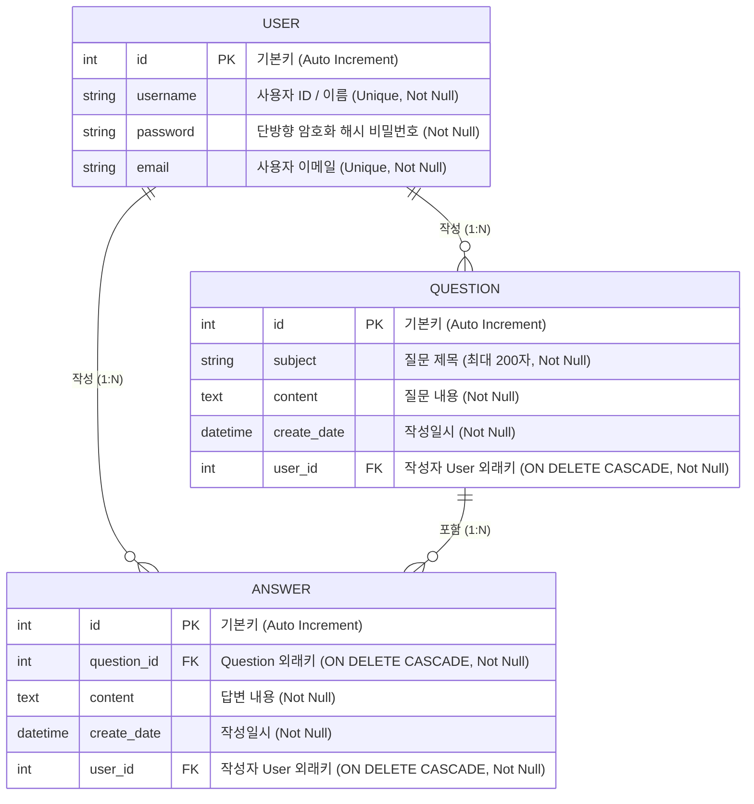

# 📘 Pybo - Flask 기반 Q&A 게시판 웹 애플리케이션 과제 설명서

본 문서는 **Flask** 프레임워크를 기반으로 개발된 질문 & 답변(Q&A) 게시판 웹 애플리케이션 **Pybo** 과제에 대한 상세 설명서입니다.  
프로젝트의 구조, 기술 스택, 데이터베이스 설계, 핵심 구현 기능 및 최신 업데이트(로그인/로그아웃, 작성자 연동, 디버깅) 내역을 정리하였습니다.

---

## 1. 📌 프로젝트 개요 (Project Overview)

- **프로젝트 명**: Pybo (Python Board)
- **과제 목적**:
  - Python 경량 웹 프레임워크인 **Flask**를 활용한 웹 애플리케이션 아키텍처 이해
  - **애플리케이션 팩토리 패턴(Application Factory Pattern)** 및 **블루프린트(Blueprint)** 모듈화 설계 습득
  - **SQLAlchemy ORM**과 **Flask-Migrate**를 활용한 RDBMS 모델링(Question, Answer, User) 및 1:N 관계 설계
  - **사용자 인증(Auth) 및 권한 제어**: 회원가입, 세션(`session`) 기반 로그인/로그아웃, `@login_required` 데코레이터를 통한 비인가 접근 차단
  - **게시글/답변 작성자(Author) 연동**: 로그인한 사용자(`g.user`)와 게시물 간의 외래키 연동
  - **Flask-WTF**를 통한 폼 데이터 수집, CSRF 보안 방어 및 유효성 검증(Validation)
  - **Jinja2 템플릿 상속**, **커스텀 필터**, 컴포넌트 모듈화(`form_errors.html`), **Bootstrap 5**를 이용한 반응형 웹 인터페이스 구축
  - 대량 데이터 처리를 위한 **페이지네이션(Pagination)** 및 게시물 일련번호 연산 공식 구현

---

## 2. 🛠 기술 스택 및 개발 환경 (Tech Stack & Environment)

| 분류 | 기술 / 라이브러리 | 설명 |
| :--- | :--- | :--- |
| **Language** | `Python 3.x` | 백엔드 핵심 프로그래밍 언어 |
| **Framework** | `Flask` | 가볍고 확장성이 뛰어난 WSGI 웹 프레임워크 |
| **ORM / Migration** | `Flask-SQLAlchemy`, `Flask-Migrate` (Alembic) | 객체-관계 매핑(ORM) 및 데이터베이스 스키마 버전 관리 |
| **Database** | `SQLite3` (`pybo.db`) | 로컬 개발 및 테스트용 파일 기반 관계형 데이터베이스 |
| **Security / Auth** | `Werkzeug.security`, Flask `session`, `g` | 비밀번호 단방향 해싱(`generate_password_hash`, `check_password_hash`), 세션 기반 사용자 인증 상태 관리 |
| **Form & Validation** | `Flask-WTF`, `WTForms`, `email-validator` | 폼 렌더링, CSRF 토큰 검증, 유효성 검사 (`DataRequired`, `Length`, `EqualTo`, `Email`) |
| **Frontend** | `HTML5`, `CSS3`, `Bootstrap 5.3.8` | 반응형 웹 UI 레이아웃 및 스타일링 |
| **Template Engine** | `Jinja2` | 서버 사이드 템플릿 상속, 모듈화(`include`), 커스텀 필터 |
| **Config / Env** | `python-dotenv` (`.flaskenv`) | 플라스크 실행 환경 변수 관리 |

---

## 3. 📂 프로젝트 디렉터리 구조 (Directory Structure)

```text
myproject/
├── .flaskenv                 # Flask 실행 환경 설정 (FLASK_APP, FLASK_DEBUG 등)
├── config.py                 # 앱 전역 설정 (DB URI, Secret Key 등)
├── pybo.db                   # SQLite 데이터베이스 파일
├── seed_questions.py         # 페이징 테스트를 위한 더미 질문(300건) 생성 스크립트
├── requirements.txt          # 프로젝트 의존성 패키지 목록
│
├── migrations/               # Flask-Migrate 데이터베이스 마이그레이션 이력 관리 폴더
│   ├── env.py
│   └── versions/             # 스키마 변경 리비전 파일들
│
└── pybo/                     # Pybo 핵심 패키지
    ├── __init__.py           # 앱 팩토리 (create_app), DB/블루프린트/Jinja 필터 등록
    ├── models.py             # SQLAlchemy ORM 모델 정의 (Question, Answer, User 외래키 연동)
    ├── forms.py              # WTForms 폼 정의 (QuestionForm, AnswerForm, UserCreateForm, UserLoginForm)
    ├── filter.py             # Jinja2 커스텀 템플릿 필터 (날짜/시간 포맷팅)
    │
    ├── static/               # 정적 파일 (CSS, JS, 이미지)
    │   └── style.css         # 전역 커스텀 스타일시트
    │
    ├── templates/            # Jinja2 템플릿 폴더
    │   ├── base.html         # 전체 페이지 공통 레이아웃
    │   ├── navbar.html       # 상단 내비게이션 바 (로그인 상태에 따른 동적 메뉴 표시)
    │   ├── form_errors.html  # 폼 검증 에러 및 Flash 메시지 공통 컴포넌트
    │   │
    │   ├── auth/             # 사용자 인증 화면 템플릿
    │   │   ├── signup.html   # 회원가입 입력 폼
    │   │   └── login.html    # 로그인 입력 폼
    │   │
    │   └── question/         # 질문/답변 화면 템플릿
    │       ├── question_list.html    # 질문 목록, 페이징, 답변 수 뱃지, 날짜 필터
    │       ├── question_detail.html  # 질문 상세 + 답변 목록 + 답변 등록 폼
    │       └── question_form.html    # 신규 질문 작성 폼
    │
    └── views/                # 컨트롤러(라우트/뷰 함수) 패키지
        ├── main_views.py     # 루트('/') 접속 시 '/question/list'로 리다이렉트
        ├── question_views.py # 질문 목록, 상세 조회, 질문 작성 (@login_required, 작성자 연동)
        ├── answer_views.py   # 특정 질문에 대한 답변 등록 (@login_required, 작성자 연동)
        └── auth_views.py     # 사용자 인증 컨트롤러 (signup, login, logout, load_logged_in_user, login_required)
```

---

## 4. 🗄 데이터베이스 모델링 (Database Modeling)

애플리케이션은 **사용자(User)**, **질문(Question)**, **답변(Answer)** 간의 관계형 구조로 설계되었습니다.



### 모델 상세 설명
1. **`User` 모델**:
   - 사용자 계정 정보(`username`, `password`, `email`)를 저장합니다.
   - 비밀번호는 보안을 위해 `werkzeug.security.generate_password_hash`를 통해 단방향 암호화되어 저장됩니다.
   - `question_set`, `answer_set` 역참조(backref)를 통해 해당 사용자가 작성한 질문과 답변 목록을 조회할 수 있습니다.
2. **`Question` 모델**:
   - 사용자가 작성한 질문 제목, 본문, 작성 일시를 관리합니다.
   - `user_id`: 작성자(`User`)의 기본키를 외래키로 참조하며, `user` 속성으로 작성자 객체에 접근합니다.
   - `answer_set`: 해당 질문에 달린 답변 목록을 역참조합니다.
3. **`Answer` 모델**:
   - 특정 질문에 연결된 답변 본문과 작성 일시를 관리합니다.
   - `question_id`: 질문(`Question`)의 기본키를 외래키로 참조하며, `ondelete="CASCADE"` 제약 조건으로 질문 삭제 시 종속 답변이 함께 삭제됩니다.
   - `user_id`: 답변 작성자(`User`)의 외래키를 참조합니다.

---

## 5. 💡 핵심 구현 기능 (Core Features)

### 1) 사용자 인증(Auth) 및 세션 관리
- **회원가입 (`/auth/signup`)**:
  - `UserCreateForm`을 통한 입력값 검증 (아이디 길이 3~25자, 비밀번호 일치 확인, 이메일 형식).
  - `generate_password_hash` 함수로 비밀번호 암호화 후 DB에 안전하게 저장.
  - 중복 아이디 가입 방지 및 `flash()` 피드백 제공.
- **로그인 (`/auth/login`)**:
  - `UserLoginForm`으로 아이디/비밀번호 검증.
  - `check_password_hash`를 사용해 입력된 비밀번호와 DB 해시값 대조.
  - 인증 성공 시 Flask 세션(`session['user_id'] = user.id`)에 사용자 식별자 저장.
  - 비인가 접근 후 로그인 시 원래 요청했던 페이지로 이동할 수 있도록 `next` 쿼리 파라미터 리다이렉트 지원.
- **로그아웃 (`/auth/logout`)**:
  - `session.clear()` 및 `g.user = None`으로 세션 초기화 후 메인 페이지 이동.
- **요청 전 로그인 사용자 로드 (`@bp.before_app_request`)**:
  - `load_logged_in_user` 함수를 통해 매 HTTP 요청마다 세션의 `user_id`를 검사하여 `g.user`에 현재 로그인된 `User` 객체를 바인딩.
- **로그인 필수 데코레이터 (`@login_required`)**:
  - 비로그인 사용자가 글을 작성하려 할 때 자동으로 로그인 페이지(`/auth/login?next=...`)로 안전하게 리다이렉트.

### 2) 게시글 / 답변 작성자(Author) 연동
- 질문 작성(`question_views.create`) 및 답변 작성(`answer_views.create`) 시, `@login_required` 데코레이터를 적용하고 현재 로그인된 사용자(`user=g.user`)를 모델 객체에 연결하여 저장.

### 3) 네비게이션 바 동적 UI (`navbar.html`)
- `g.user` 존재 여부에 따라 상단 내비바 메뉴 동적 전환:
  - **비로그인 상태**: `회원가입`, `Login` 버튼 노출
  - **로그인 상태**: `Logout` 버튼 노출

### 4) 질문 목록 UI 및 페이징(Pagination)
- **게시물 고유 가상 일련번호 연산 공식 적용**:
  ```jinja2
  {{ question_list.total - ((question_list.page - 1) * question_list.per_page) - loop.index0 }}
  ```
  페이지가 넘어가도 전체 기준 내림차순 일련번호가 정확하게 유지됩니다.
- **답변 수 뱃지 표시**:
  ```jinja2
  
      <span class="text-danger small mx-2">[{{ question.answer_set|length }}]</span>
  
  ```

### 5) 템플릿 컴포넌트화 및 커스텀 필터
- **`form_errors.html`**: 폼 유효성 오류 및 Flash 메시지를 일괄 처리하는 공통 컴포넌트 분리 (`include`).
- **`filter.py`**: 날짜/시간 형식을 한국어 환경에 맞게 포맷팅하는 `format_datetime` Jinja2 필터 등록.

---

## 6. 📝 최근 업데이트 및 디버깅 내역 (2026.09.17)

| 구분 | 파일 경로 | 변경 유형 | 주요 작업 내용 |
| :---: | :--- | :---: | :--- |
| **Model** | [pybo/models.py](file:///d:/hongdonjoo/flask/myproject/pybo/models.py) | **수정** | `Question`, `Answer` 모델에 `user_id` 외래키 및 `user` 관계 추가, 잘못된 auto-import 제거 및 문자열 참조 `'User'`로 수정 |
| **Form** | [pybo/forms.py](file:///d:/hongdonjoo/flask/myproject/pybo/forms.py) | **수정** | 로그인 처리를 위한 `UserLoginForm` 클래스 추가 (`username`, `password`) |
| **View** | [pybo/views/auth_views.py](file:///d:/hongdonjoo/flask/myproject/pybo/views/auth_views.py) | **수정** | `login`, `logout` 라우트 구현, `load_logged_in_user`(`g.user` 초기화), `@login_required` 데코레이터 구현 |
| **View** | [pybo/views/question_views.py](file:///d:/hongdonjoo/flask/myproject/pybo/views/question_views.py) | **수정** | 질문 작성 라우트에 `@login_required` 적용 및 질문 객체 생성 시 `user=g.user` 저장 로직 추가 |
| **View** | [pybo/views/answer_views.py](file:///d:/hongdonjoo/flask/myproject/pybo/views/answer_views.py) | **수정** | 답변 작성 라우트에 `@login_required` 적용 및 답변 객체 생성 시 `user=g.user` 저장 로직 추가 |
| **Template** | [pybo/templates/auth/login.html](file:///d:/hongdonjoo/flask/myproject/pybo/templates/auth/login.html) | **신규** | 로그인 화면 UI 템플릿 구현 및 템플릿 상속 태그 문법 오류 수정 |
| **Template** | [pybo/templates/navbar.html](file:///d:/hongdonjoo/flask/myproject/pybo/templates/navbar.html) | **수정** | `g.user` 로그인 상태에 따라 '회원가입/로그인' $\leftrightarrow$ '로그아웃' 동적 렌더링 |
| **DB** | [pybo.db](file:///d:/hongdonjoo/flask/myproject/pybo.db) | **수정** | `question`, `answer` 테이블에 `user_id` 외래키 컬럼 마이그레이션 적용 |

### 🔍 주요 버그 해결 (Troubleshooting)
1. **`UnmappedClassError: Class 'sqlalchemy.testing.pickleable.User' is not mapped`**:
   - IDE 자동 완성이 잘못된 테스트용 `User` 모듈을 임포트하여 발생한 500 오류. 잘못된 import 문을 제거하고 `db.relationship('User', ...)` 문자열 참조로 수정하여 해결.
2. **`AttributeError: user (in login_required)`**:
   - `load_logged_in_user`에서 세션이 없을 때 `g.user = None`으로 초기화하지 않아 발생한 500 오류. 미로그인 시 명시적으로 `g.user = None`을 대입하도록 보완.
3. **`TemplateSyntaxError: unexpected '}' in login.html`**:
   - 상속 태그 `{% extends "base.html"}`에서 닫는 `%`가 누락된 오타를 ``로 수정.
4. **질문 생성 시 `user_id` NOT NULL 제약조건 오류**:
   - 질문 작성 시 로그인된 사용자인 `user=g.user`를 인자로 넘기도록 수정.

---

## 7. 🚀 설치 및 실행 가이드 (Getting Started)

### 1) 가상환경 생성 및 활성화
```bash
# 가상환경 생성 (최초 1회)
python -m venv .venv

# 가상환경 활성화 (Windows PowerShell 기준)
.venv\Scripts\Activate.ps1
```

### 2) 필요한 패키지 설치
```bash
pip install -r requirements.txt
```

### 3) 데이터베이스 마이그레이션 적용
```bash
# 최신 스키마(Question, Answer, User 및 외래키) 적용
flask db migrate
flask db upgrade
```

### 4) 플라스크 개발 서버 실행
```bash
flask run
```
- 브라우저에서 `http://127.0.0.1:5000/` 접속 시 질문 목록 페이지로 이동합니다.
- 상단 내비바를 통해 회원가입(`/auth/signup`) 및 로그인(`/auth/login`)을 진행할 수 있습니다.
- 로그인한 사용자만 질문 및 답변을 작성할 수 있습니다.

---

## 8. 🔮 향후 과제 발전 방향 (Future Improvements)

1. **질문 / 답변 상세 화면에서 작성자 정보 표시**
   - 질문 상세 페이지(`question_detail.html`) 및 질문 목록에 질문/답변 작성자의 `username` 뱃지 노출
2. **게시글 및 답변 수정 / 삭제 기능**
   - 작성자 본인만 수정/삭제할 수 있는 권한 검증 라우트 및 UI 버튼 추가
3. **추천(Vote) 기능**
   - 질문 및 답변에 대한 다대다(M:N) 추천 테이블 모델링 및 추천 기능 구현
4. **검색 및 정렬 기능**
   - 키워드(제목, 내용, 작성자) 검색 쿼리 및 최신순/추천순/답변순 정렬 필터 적용
5. **마크다운(Markdown) 지원**
   - 본문 작성 시 마크다운 에디터 지원 및 XSS 보안 필터링(Sanitizer) 적용
