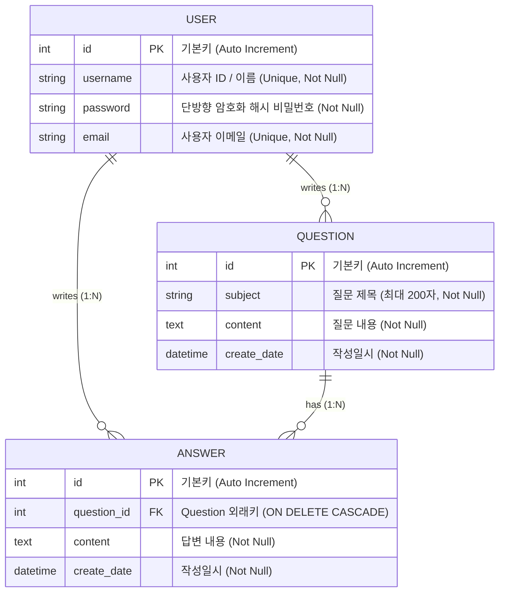

# 📘 Pybo - Flask 기반 Q&A 게시판 웹 애플리케이션 과제 설명서

본 문서는 **Flask** 프레임워크를 기반으로 개발된 질문 & 답변(Q&A) 게시판 웹 애플리케이션 **Pybo** 과제에 대한 상세 설명서입니다.  
프로젝트의 구조, 기술 스택, 데이터베이스 설계, 핵심 구현 기능 및 실행 방법 등을 정리하였습니다.
프로젝트의 구조, 기술 스택, 데이터베이스 설계, 핵심 구현 기능 및 금일 업데이트된 작업 내역을 정리하였습니다.

---

## 1. 📌 프로젝트 개요 (Project Overview)

- **프로젝트 명**: Pybo (Python Board)
- **과제 목적**:
  - Python 경량 웹 프레임워크인 **Flask**를 활용한 웹 애플리케이션 아키텍처 이해
  - **애플리케이션 팩토리 패턴(Application Factory Pattern)** 및 **블루프린트(Blueprint)** 모듈화 설계 습득
  - **SQLAlchemy ORM**과 **Flask-Migrate**를 활용한 RDBMS 모델링 및 마이그레이션 관리
  - **Flask-WTF**를 통한 폼 데이터 수집, CSRF 보안 방어 및 유효성 검증(Validation)
  - **Jinja2 템플릿 상속** 및 **Bootstrap 5**를 이용한 반응형 웹 인터페이스 구축
  - 대량 데이터 처리를 위한 **페이지네이션(Pagination)** 구현
  - **Jinja2 템플릿 상속**, **커스텀 필터**, 컴포넌트 분리(`include`) 및 **Bootstrap 5**를 이용한 반응형 웹 인터페이스 구축
  - 대량 데이터 처리를 위한 **페이지네이션(Pagination)** 및 게시물 번호 연산 구현
  - **회원가입 및 비밀번호 단방향 암호화(Hashing)** 등 사용자 인증(Auth) 기초 구축

---

## 2. 🛠 기술 스택 및 개발 환경 (Tech Stack & Environment)

| 분류 | 기술 / 라이브러리 | 설명 |
| :--- | :--- | :--- |
| **Language** | `Python 3.x` | 백엔드 핵심 프로그래밍 언어 |
| **Framework** | `Flask` | 가볍고 확장성이 뛰어난 WSGI 웹 프레임워크 |
| **ORM / Migration** | `Flask-SQLAlchemy`, `Flask-Migrate` (Alembic) | 객체-관계 매핑(ORM) 및 데이터베이스 스키마 버전 관리 |
| **Database** | `SQLite3` (`pybo.db`) | 로컬 개발 및 테스트용 파일 기반 관계형 데이터베이스 |
| **Form & Validation** | `Flask-WTF`, `WTForms` | 폼 렌더링, CSRF 토큰 검증, 입력값 유효성 검사 |
| **Security / Auth** | `Werkzeug.security` | 비밀번호 단방향 해싱(`generate_password_hash`, `check_password_hash`) |
| **Form & Validation** | `Flask-WTF`, `WTForms`, `email-validator` | 폼 렌더링, CSRF 토큰 검증, 이메일/비밀번호 유효성 검사 |
| **Frontend** | `HTML5`, `CSS3`, `Bootstrap 5.3.8` | 반응형 웹 UI 레이아웃 및 스타일링 |
| **Template Engine** | `Jinja2` | 서버 사이드 템플릿 상속 및 데이터 바인딩 |
| **Template Engine** | `Jinja2` | 서버 사이드 템플릿 상속, 모듈화(`include`), 커스텀 필터 |
| **Config / Env** | `python-dotenv` (`.flaskenv`) | 플라스크 실행 환경 변수 관리 |

---

## 3. 📂 프로젝트 디렉터리 구조 (Directory Structure)

```text
myproject/
├── .flaskenv                 # Flask 실행 환경 설정 (FLASK_APP, FLASK_DEBUG 등)
├── config.py                 # 앱 전역 설정 (DB URI, Secret Key 등)
├── pybo.db                   # SQLite 데이터베이스 파일
├── seed_questions.py         # 페이징 테스트를 위한 더미 질문(300건) 생성 스크립트
├── requirements.txt          # 프로젝트 의존성 패키지 목록
│
├── migrations/               # Flask-Migrate 데이터베이스 마이그레이션 이력 관리 폴더
│   ├── env.py
│   └── versions/             # 스키마 변경 리비전 파일들
│
└── pybo/                     # Pybo 핵심 패키지
    ├── __init__.py           # 애플리케이션 팩토리 (create_app), DB 및 블루프린트 등록
    ├── models.py             # SQLAlchemy ORM 모델 정의 (Question, Answer)
    ├── forms.py              # WTForms 폼 클래스 정의 (QuestionForm, AnswerForm)
    ├── __init__.py           # 앱 팩토리 (create_app), DB/블루프린트/Jinja 필터 등록 [UPDATE]
    ├── models.py             # SQLAlchemy ORM 모델 정의 (Question, Answer, User) [UPDATE]
    ├── forms.py              # WTForms 폼 정의 (QuestionForm, AnswerForm, UserCreateForm) [UPDATE]
    ├── filter.py             # Jinja2 커스텀 템플릿 필터 (날짜 포맷팅) [NEW]
    │
    ├── static/               # 정적 파일 (CSS, JS, 이미지)
    │   └── style.css         # 전역 커스텀 스타일시트
    │
    ├── templates/            # Jinja2 템플릿 폴더
    │   ├── base.html         # 전체 페이지 공통 템플릿 (Bootstrap CDN, 네비바 포함)
    │   ├── navbar.html       # 상단 내비게이션 바 컴포넌트
    │   └── question/         # 질문 관련 화면 템플릿
    │       ├── question_list.html    # 질문 목록 및 페이징 UI
    │       ├── question_detail.html  # 질문 상세 내용 + 답변 목록 + 답변 작성 폼
    │       └── question_form.html    # 신규 질문 작성 폼
    │   ├── base.html         # 전체 페이지 공통 레이아웃
    │   ├── navbar.html       # 상단 내비게이션 바 (회원가입 링크 연동) [UPDATE]
    │   ├── form_errors.html  # 폼 검증 에러 및 Flash 메시지 공통 컴포넌트 [NEW]
    │   │
    │   ├── auth/             # 인증 관련 화면 템플릿 [NEW]
    │   │   └── signup.html   # 회원가입 입력 폼 [NEW]
    │   │
    │   └── question/         # 질문/답변 관련 화면 템플릿
    │       ├── question_list.html    # 질문 목록, 페이징, 답변수 표시, 날짜필터 [UPDATE]
    │       ├── question_detail.html  # 질문 상세 + 답변 목록 + 에러 컴포넌트 적용 [UPDATE]
    │       └── question_form.html    # 질문 작성 폼 + 에러 컴포넌트 적용 [UPDATE]
    │
    └── views/                # 컨트롤러(라우트/뷰 함수) 패키지
        ├── main_views.py     # 루트('/') 접속 시 '/question/list'로 리다이렉트
        ├── question_views.py # 질문 목록, 상세 조회, 질문 작성 라우트
        └── answer_views.py   # 특정 질문에 대한 답변 등록 라우트
        ├── answer_views.py   # 특정 질문에 대한 답변 등록 라우트
        └── auth_views.py     # 사용자 인증 컨트롤러 (회원가입 /auth/signup) [NEW]
```

---

## 4. 🗄 데이터베이스 모델링 (Database Modeling)

애플리케이션은 **질문(Question)**과 **답변(Answer)**의 1:N 관계를 기반으로 구성되어 있습니다.
애플리케이션은 **질문(Question)**, **답변(Answer)**의 1:N 관계와 함께 사용자 계정 관리를 위한 **사용자(User)** 엔티티를 포함합니다.



### 모델 상세 설명
1. **`Question` 모델**:
   - 사용자가 작성한 질문의 제목, 본문, 작성 일자를 저장합니다.
   - `answer_set` 역참조(backref)를 통해 해당 질문에 달린 답변 목록을 객체 그래프 형태로 탐색할 수 있습니다.
2. **`Answer` 모델**:
   - 특정 질문에 연결된 답변 본문 및 작성 일자를 관리합니다.
   - `ondelete="CASCADE"` 외래키 제약조건이 지정되어 있어 질문 삭제 시 종속된 답변들이 함께 정리됩니다.
1. **`User` 모델 (신규 추가)**:
   - 사용자 계정 정보(`username`, `password`, `email`)를 저장합니다.
   - 비밀번호는 보안을 위해 원본 평문이 아닌 `werkzeug.security.generate_password_hash`를 통한 단방향 해시 문자열로 안전하게 보관됩니다.
2. **`Question` 모델**:
   - 질문 제목, 본문, 작성 일자를 관리합니다.
   - `answer_set` 역참조(backref)를 통해 종속된 답변 목록에 접근합니다.
3. **`Answer` 모델**:
   - 질문에 대한 답변 본문 및 작성 일자를 관리합니다.
   - `ondelete="CASCADE"` 제약 조건으로 연결된 질문 삭제 시 함께 정리됩니다.

---

## 5. 💡 핵심 구현 기능 (Core Features)

### 1) 애플리케이션 팩토리 패턴 (`create_app`)
- 순환 참조(Circular Import) 방지 및 테스트/확장 용이성을 위해 `create_app()` 함수 내에서 `Flask` 객체를 생성하고 확장 플러그인(`db`, `migrate`)과 블루프린트(`main`, `question`, `answer`)를 초기화합니다.
### 1) 사용자 인증(Auth) - 회원가입 구현
- **경로**: `/auth/signup` ([auth_views.py](file:///d:/hongdonjoo/flask/myproject/pybo/views/auth_views.py))
- **`UserCreateForm` 유효성 검사**: 사용자 이름 길이 체크(3~25자), 비밀번호 일치 검사(`EqualTo`), 유효한 이메일 형식 검사(`Email()`).
- **보안 암호화**: `generate_password_hash`를 적용해 데이터베이스에 안전하게 비밀번호 저장.
- **중복 검사 및 알림**: 이미 가입된 아이디가 존재할 경우 `flash()` 메시지로 사용자에게 피드백 제공.

### 2) 블루프린트 기반 모듈 분리
- **`main_views`**: 기본 인덱스 및 진입점 관리 (`/` -> `/question/list` 리다이렉션)
- **`question_views`**: 질문 CRUD 및 페이징 비즈니스 로직
- **`answer_views`**: 답변 생성 및 검증 로직
### 2) 커스텀 Jinja2 템플릿 필터 (`filter.py`)
- 파이썬의 `strftime`을 활용한 커스텀 날짜 필터 `format_datetime` 구현.
- `pybo/__init__.py`에 `app.jinja_env.filters['datetime'] = format_datetime` 등록.
- 템플릿에서 `{{ question.create_date|datetime }}` 형태로 직관적이고 통일된 포맷(`%Y년 %m월 %d일 %p %I:%M`) 출력.

### 3) 질문 목록 및 페이징(Pagination) 처리
- `Question.query.order_by(Question.create_date.desc()).paginate(page=page, per_page=10)`
- 최신 글 순서로 페이지당 10개씩 분할 조회
- `has_prev`, `has_next`, `iter_pages()`를 활용해 직관적인 이전/다음/페이지 번호 내비게이션 바 구현
### 3) 공통 에러 & Flash 메시지 컴포넌트화 (`form_errors.html`)
- 각 템플릿마다 중복 작성되던 폼 입력 유효성 에러(`form.errors`) 및 플래시 알림(`get_flashed_messages()`) 영역을 `form_errors.html`로 분리.
- 질문 작성, 답변 등록, 회원가입 템플릿에서 `` 구문으로 재사용성 극대화.

### 4) Flask-WTF 기반 폼 유효성 검사 및 CSRF 방어
- `QuestionForm`, `AnswerForm`을 정의하여 `DataRequired` 검증을 수행합니다.
- 폼 전송 시 `csrf_token`을 자동 검증하여 사이트 간 요청 위조(CSRF) 공격을 방어합니다.
- 공백 제출 시 템플릿에 에러 메시지를 표시하여 사용자 입력 오류를 안내합니다.
### 4) 질문 목록 UI 및 번호 계산 공식 개선
- **게시물 고유 가상 일련번호 공식 적용**:
  `번호 = 전체게시물수 - ((현재페이지 - 1) * 페이지당게시물수) - 루프인덱스`
  ```jinja2
  {{ question_list.total - ((question_list.page - 1) * question_list.per_page) - loop.index0 }}
  ```
  페이지가 넘어가도 전체 기준 내림차순 번호가 정확하게 유지됩니다.
- **답변 개수 표시 배지**:
  `question.answer_set|length` 필터를 활용하여 해당 질문에 달린 답변 수를 직관적으로 표시:
  ```jinja2
  
      <span class="text-danger small mx-2">[{{ question.answer_set|length }}]</span>
  
  ```

### 5) 시드 데이터 스크립트 (`seed_questions.py`)
- 페이징 기능 및 성능 테스트를 위해 질문 300건을 한 번에 생성/저장하는 자동화 스크립트 제공
### 5) 블루프린트 모듈화 & 애플리케이션 팩토리
- 기능별 라우트를 블루프린트로 독립 관리:
  - `main_views`: 메인 리다이렉트
  - `question_views`: 질문 CRUD 및 페이징
  - `answer_views`: 답변 생성
  - `auth_views`: 사용자 인증 및 계정 관리

---

## 6. 🚀 설치 및 실행 가이드 (Getting Started)
## 6. 📝 금일 업데이트 파일 및 작업 내역 (Today's Update Summary)

오늘 반영된 주요 변경 사항과 수정된 파일 목록입니다.

| 구분 | 파일 경로 | 변경 유형 | 주요 작업 내용 |
| :---: | :--- | :---: | :--- |
| **Model** | [pybo/models.py](file:///d:/hongdonjoo/flask/myproject/pybo/models.py) | **수정** | 사용자 인증을 위한 `User` 모델 추가 (`username`, `password`, `email`) |
| **Form** | [pybo/forms.py](file:///d:/hongdonjoo/flask/myproject/pybo/forms.py) | **수정** | 회원가입 폼 `UserCreateForm` 추가 (비밀번호 확인 `EqualTo`, 이메일 검증) |
| **View** | [pybo/views/auth_views.py](file:///d:/hongdonjoo/flask/myproject/pybo/views/auth_views.py) | **신규** | `auth` 블루프린트 생성 및 회원가입(`signup`) 뷰 함수 작성 (비밀번호 해시화, 중복 체크) |
| **App** | [pybo/\_\_init\_\_.py](file:///d:/hongdonjoo/flask/myproject/pybo/__init__.py) | **수정** | `auth_views.bp` 블루프린트 등록 및 `datetime` 커스텀 Jinja2 필터 등록 |
| **Filter** | [pybo/filter.py](file:///d:/hongdonjoo/flask/myproject/pybo/filter.py) | **신규** | 날짜/시간 포맷팅 커스텀 필터 함수 `format_datetime()` 정의 |
| **Template** | [pybo/templates/form_errors.html](file:///d:/hongdonjoo/flask/myproject/pybo/templates/form_errors.html) | **신규** | 폼 유효성 에러 및 플래시 메시지 출력을 위한 공통 모듈 컴포넌트 생성 |
| **Template** | [pybo/templates/auth/signup.html](file:///d:/hongdonjoo/flask/myproject/pybo/templates/auth/signup.html) | **신규** | 회원가입 화면 UI 템플릿 구현 |
| **Template** | [pybo/templates/navbar.html](file:///d:/hongdonjoo/flask/myproject/pybo/templates/navbar.html) | **수정** | 상단 내비바의 '회원가입' 버튼에 `url_for('auth.signup')` 링크 연결 |
| **Template** | [pybo/templates/question/question_list.html](file:///d:/hongdonjoo/flask/myproject/pybo/templates/question/question_list.html) | **수정** | 게시물 일련번호 공식 적용, 답변 수 뱃지(`answer_set\|length`), 날짜 필터 적용 |
| **Template** | [pybo/templates/question/question_form.html](file:///d:/hongdonjoo/flask/myproject/pybo/templates/question/question_form.html) | **수정** | 중복 에러 코드를 `form_errors.html` `include`로 리팩토링 |
| **Template** | [pybo/templates/question/question_detail.html](file:///d:/hongdonjoo/flask/myproject/pybo/templates/question/question_detail.html) | **수정** | 날짜 필터 적용 및 에러 코드를 `form_errors.html` `include`로 리팩토링 |
| **DB** | [pybo.db](file:///d:/hongdonjoo/flask/myproject/pybo.db) | **수정** | `user` 테이블 생성 및 마이그레이션 적용 |

---

## 7. 🚀 설치 및 실행 가이드 (Getting Started)

### 1) 가상환경 생성 및 활성화
```bash
# 가상환경 생성 (최초 1회)
python -m venv .venv

# 가상환경 활성화 (Windows PowerShell 기준)
.venv\Scripts\Activate.ps1
```

### 2) 필요한 패키지 설치
```bash
pip install -r requirements.txt
```

### 3) 데이터베이스 마이그레이션 적용
```bash
# 마이그레이션 적용 (테이블 생성)
# 최신 스키마(Question, Answer, User) 적용
flask db migrate
flask db upgrade
```

### 4) (선택) 페이징 테스트를 위한 더미 데이터 생성
### 4) 플라스크 개발 서버 실행
```bash
python seed_questions.py
```
> `pybo.db`에 300개의 테스트용 질문 레코드가 등록됩니다.

### 5) 플라스크 개발 서버 실행
```bash
flask run
```
브라우저에서 `http://127.0.0.1:5000/` 접속 시 질문 목록 페이지로 자동 이동합니다.
- 브라우저에서 `http://127.0.0.1:5000/` 접속 시 질문 목록 페이지로 이동합니다.
- 상단 네비게이션 바의 **회원가입** 메뉴 또는 `http://127.0.0.1:5000/auth/signup`에서 신규 계정을 등록할 수 있습니다.

---

## 7. 🔮 향후 과제 발전 방향 (Future Improvements)
## 8. 🔮 향후 과제 발전 방향 (Future Improvements)

1. **사용자 인증 및 권한 관리 (Auth)**
   - `User` 모델 구축 및 비밀번호 암호화(Werkzeug security / bcrypt)
   - 회원가입, 로그인, 로그아웃 기능 구현
   - 비로그인 사용자의 작성 제한 및 로그인 필수 데코레이터(`@login_required`) 적용
2. **게시글 및 답변 수정 / 삭제**
   - 작성자 본인만 수정/삭제할 수 있는 권한 검증 로직 추가
3. **추천(Vote) 및 댓글(Comment) 기능**
   - 질문 및 답변에 대한 다대다(M:N) 추천 기능
   - 질문/답변 하위에 간단한 댓글을 남길 수 있는 서브 엔티티 추가
4. **검색 및 정렬 기능**
   - 키워드(제목, 내용, 작성자) 검색 쿼리 연동
   - 최신순, 추천순, 답변순 정렬 필터 기능
5. **마크다운(Markdown) 지원**
   - 본문 작성 시 마크다운 문법 지원 및 XSS 방어(Sanitizer) 적용
1. **로그인 / 로그아웃 기능 구현**
   - 세션(Session) 기반 또는 Flask-Login을 통한 로그인/로그아웃 구현
   - 네비게이션 바에서 로그인 상태에 따라 '로그인 / 로그아웃' 동적 토글
2. **질문 / 답변 작성자(Author) 연동**
   - `Question`, `Answer` 모델에 `user_id` 외래키 추가
   - 비로그인 사용자 작성 제한 및 `@login_required` 데코레이터 적용
3. **게시글 및 답변 수정 / 삭제**
   - 작성자 본인 확인 권한 검증 및 수정/삭제 라우트 추가
4. **추천(Vote) 기능**
   - 게시글 및 답변에 대한 다대다(M:N) 추천 테이블 구현
5. **검색 및 정렬 기능**
   - 제목, 내용, 작성자 대상 검색 및 정렬(최신순, 추천순, 답변순) 필터
