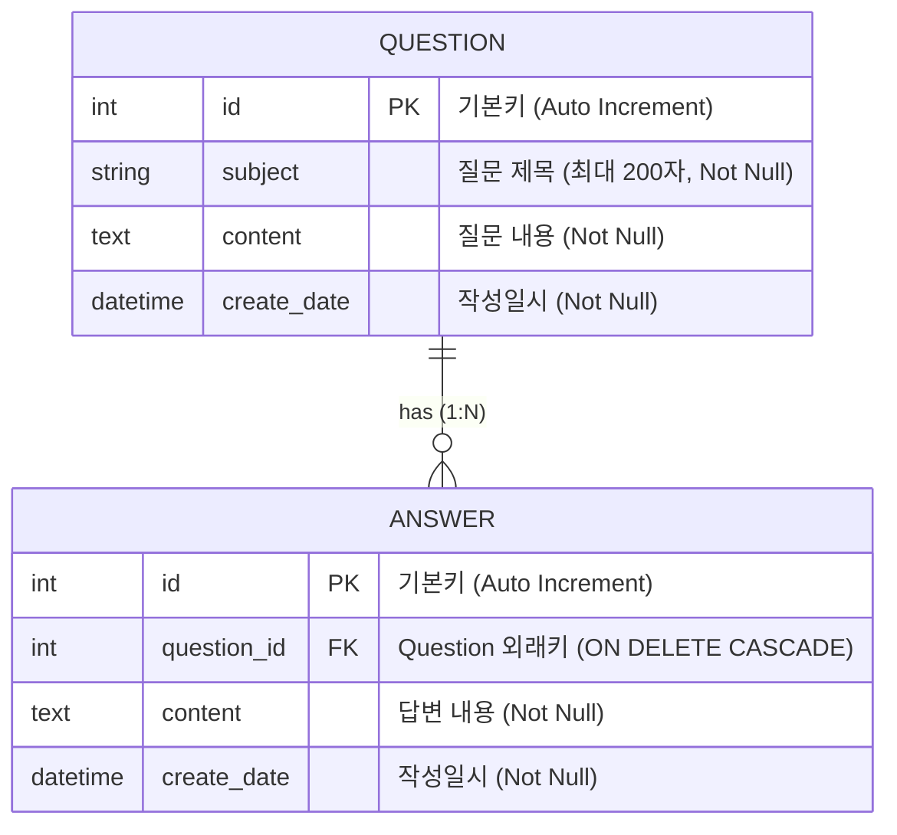

# 📘 Pybo - Flask 기반 Q&A 게시판 웹 애플리케이션 과제 설명서

본 문서는 **Flask** 프레임워크를 기반으로 개발된 질문 & 답변(Q&A) 게시판 웹 애플리케이션 **Pybo** 과제에 대한 상세 설명서입니다.  
프로젝트의 구조, 기술 스택, 데이터베이스 설계, 핵심 구현 기능 및 실행 방법 등을 정리하였습니다.

---

## 1. 📌 프로젝트 개요 (Project Overview)

- **프로젝트 명**: Pybo (Python Board)
- **과제 목적**:
  - Python 경량 웹 프레임워크인 **Flask**를 활용한 웹 애플리케이션 아키텍처 이해
  - **애플리케이션 팩토리 패턴(Application Factory Pattern)** 및 **블루프린트(Blueprint)** 모듈화 설계 습득
  - **SQLAlchemy ORM**과 **Flask-Migrate**를 활용한 RDBMS 모델링 및 마이그레이션 관리
  - **Flask-WTF**를 통한 폼 데이터 수집, CSRF 보안 방어 및 유효성 검증(Validation)
  - **Jinja2 템플릿 상속** 및 **Bootstrap 5**를 이용한 반응형 웹 인터페이스 구축
  - 대량 데이터 처리를 위한 **페이지네이션(Pagination)** 구현

---

## 2. 🛠 기술 스택 및 개발 환경 (Tech Stack & Environment)

| 분류 | 기술 / 라이브러리 | 설명 |
| :--- | :--- | :--- |
| **Language** | `Python 3.x` | 백엔드 핵심 프로그래밍 언어 |
| **Framework** | `Flask` | 가볍고 확장성이 뛰어난 WSGI 웹 프레임워크 |
| **ORM / Migration** | `Flask-SQLAlchemy`, `Flask-Migrate` (Alembic) | 객체-관계 매핑(ORM) 및 데이터베이스 스키마 버전 관리 |
| **Database** | `SQLite3` (`pybo.db`) | 로컬 개발 및 테스트용 파일 기반 관계형 데이터베이스 |
| **Form & Validation** | `Flask-WTF`, `WTForms` | 폼 렌더링, CSRF 토큰 검증, 입력값 유효성 검사 |
| **Frontend** | `HTML5`, `CSS3`, `Bootstrap 5.3.8` | 반응형 웹 UI 레이아웃 및 스타일링 |
| **Template Engine** | `Jinja2` | 서버 사이드 템플릿 상속 및 데이터 바인딩 |
| **Config / Env** | `python-dotenv` (`.flaskenv`) | 플라스크 실행 환경 변수 관리 |

---

## 3. 📂 프로젝트 디렉터리 구조 (Directory Structure)

```text
myproject/
├── .flaskenv                 # Flask 실행 환경 설정 (FLASK_APP, FLASK_DEBUG 등)
├── config.py                 # 앱 전역 설정 (DB URI, Secret Key 등)
├── pybo.db                   # SQLite 데이터베이스 파일
├── seed_questions.py         # 페이징 테스트를 위한 더미 질문(300건) 생성 스크립트
├── requirements.txt          # 프로젝트 의존성 패키지 목록
│
├── migrations/               # Flask-Migrate 데이터베이스 마이그레이션 이력 관리 폴더
│   ├── env.py
│   └── versions/             # 스키마 변경 리비전 파일들
│
└── pybo/                     # Pybo 핵심 패키지
    ├── __init__.py           # 애플리케이션 팩토리 (create_app), DB 및 블루프린트 등록
    ├── models.py             # SQLAlchemy ORM 모델 정의 (Question, Answer)
    ├── forms.py              # WTForms 폼 클래스 정의 (QuestionForm, AnswerForm)
    │
    ├── static/               # 정적 파일 (CSS, JS, 이미지)
    │   └── style.css         # 전역 커스텀 스타일시트
    │
    ├── templates/            # Jinja2 템플릿 폴더
    │   ├── base.html         # 전체 페이지 공통 템플릿 (Bootstrap CDN, 네비바 포함)
    │   ├── navbar.html       # 상단 내비게이션 바 컴포넌트
    │   └── question/         # 질문 관련 화면 템플릿
    │       ├── question_list.html    # 질문 목록 및 페이징 UI
    │       ├── question_detail.html  # 질문 상세 내용 + 답변 목록 + 답변 작성 폼
    │       └── question_form.html    # 신규 질문 작성 폼
    │
    └── views/                # 컨트롤러(라우트/뷰 함수) 패키지
        ├── main_views.py     # 루트('/') 접속 시 '/question/list'로 리다이렉트
        ├── question_views.py # 질문 목록, 상세 조회, 질문 작성 라우트
        └── answer_views.py   # 특정 질문에 대한 답변 등록 라우트
```

---

## 4. 🗄 데이터베이스 모델링 (Database Modeling)

애플리케이션은 **질문(Question)**과 **답변(Answer)**의 1:N 관계를 기반으로 구성되어 있습니다.



### 모델 상세 설명
1. **`Question` 모델**:
   - 사용자가 작성한 질문의 제목, 본문, 작성 일자를 저장합니다.
   - `answer_set` 역참조(backref)를 통해 해당 질문에 달린 답변 목록을 객체 그래프 형태로 탐색할 수 있습니다.
2. **`Answer` 모델**:
   - 특정 질문에 연결된 답변 본문 및 작성 일자를 관리합니다.
   - `ondelete="CASCADE"` 외래키 제약조건이 지정되어 있어 질문 삭제 시 종속된 답변들이 함께 정리됩니다.

---

## 5. 💡 핵심 구현 기능 (Core Features)

### 1) 애플리케이션 팩토리 패턴 (`create_app`)
- 순환 참조(Circular Import) 방지 및 테스트/확장 용이성을 위해 `create_app()` 함수 내에서 `Flask` 객체를 생성하고 확장 플러그인(`db`, `migrate`)과 블루프린트(`main`, `question`, `answer`)를 초기화합니다.

### 2) 블루프린트 기반 모듈 분리
- **`main_views`**: 기본 인덱스 및 진입점 관리 (`/` -> `/question/list` 리다이렉션)
- **`question_views`**: 질문 CRUD 및 페이징 비즈니스 로직
- **`answer_views`**: 답변 생성 및 검증 로직

### 3) 질문 목록 및 페이징(Pagination) 처리
- `Question.query.order_by(Question.create_date.desc()).paginate(page=page, per_page=10)`
- 최신 글 순서로 페이지당 10개씩 분할 조회
- `has_prev`, `has_next`, `iter_pages()`를 활용해 직관적인 이전/다음/페이지 번호 내비게이션 바 구현

### 4) Flask-WTF 기반 폼 유효성 검사 및 CSRF 방어
- `QuestionForm`, `AnswerForm`을 정의하여 `DataRequired` 검증을 수행합니다.
- 폼 전송 시 `csrf_token`을 자동 검증하여 사이트 간 요청 위조(CSRF) 공격을 방어합니다.
- 공백 제출 시 템플릿에 에러 메시지를 표시하여 사용자 입력 오류를 안내합니다.

### 5) 시드 데이터 스크립트 (`seed_questions.py`)
- 페이징 기능 및 성능 테스트를 위해 질문 300건을 한 번에 생성/저장하는 자동화 스크립트 제공

---

## 6. 🚀 설치 및 실행 가이드 (Getting Started)

### 1) 가상환경 생성 및 활성화
```bash
# 가상환경 생성 (최초 1회)
python -m venv .venv

# 가상환경 활성화 (Windows PowerShell 기준)
.venv\Scripts\Activate.ps1
```

### 2) 필요한 패키지 설치
```bash
pip install -r requirements.txt
```

### 3) 데이터베이스 마이그레이션 적용
```bash
# 마이그레이션 적용 (테이블 생성)
flask db upgrade
```

### 4) (선택) 페이징 테스트를 위한 더미 데이터 생성
```bash
python seed_questions.py
```
> `pybo.db`에 300개의 테스트용 질문 레코드가 등록됩니다.

### 5) 플라스크 개발 서버 실행
```bash
flask run
```
브라우저에서 `http://127.0.0.1:5000/` 접속 시 질문 목록 페이지로 자동 이동합니다.

---

## 7. 🔮 향후 과제 발전 방향 (Future Improvements)

1. **사용자 인증 및 권한 관리 (Auth)**
   - `User` 모델 구축 및 비밀번호 암호화(Werkzeug security / bcrypt)
   - 회원가입, 로그인, 로그아웃 기능 구현
   - 비로그인 사용자의 작성 제한 및 로그인 필수 데코레이터(`@login_required`) 적용
2. **게시글 및 답변 수정 / 삭제**
   - 작성자 본인만 수정/삭제할 수 있는 권한 검증 로직 추가
3. **추천(Vote) 및 댓글(Comment) 기능**
   - 질문 및 답변에 대한 다대다(M:N) 추천 기능
   - 질문/답변 하위에 간단한 댓글을 남길 수 있는 서브 엔티티 추가
4. **검색 및 정렬 기능**
   - 키워드(제목, 내용, 작성자) 검색 쿼리 연동
   - 최신순, 추천순, 답변순 정렬 필터 기능
5. **마크다운(Markdown) 지원**
   - 본문 작성 시 마크다운 문법 지원 및 XSS 방어(Sanitizer) 적용
